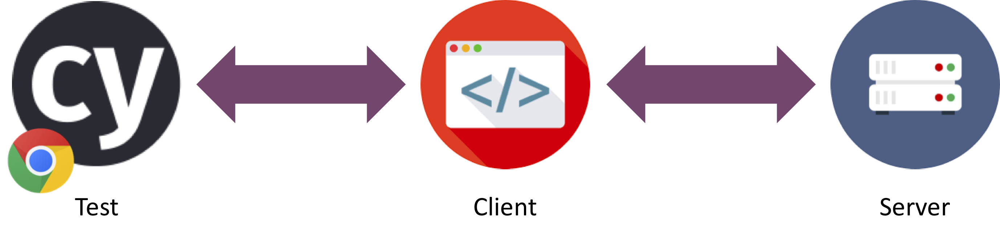

# OVERVIEW AND INSTALLATION

## Welcome !

These pages serve as documentation for the Playwright Training. You can work through the exercises at your own pace. Read carefully and if you have any questions feel free to ask.

The system under test that we will be using is a tabular music tracker. It consists of a server part, which interfaces with the database. The most visible part is the client, which runs in a browser. It is built with VueJS, which is a front end framework. We will focus on testing the client with Playwright.



## Running the project

In order to run the project locally, it is required that you have `node` and `git` installed. For `node` version 8.2.1 or higher is required.

If you don't have these installed yet you can find them here:

- <https://nodejs.org/en/download/>
- <https://git-scm.com/download/>

Afterwards follow the instructions in the next section 'Checking out the project'.

## Checking out the project

1. Clone the [project from GitHub](https://github.com/xebia/cypress-training)

``` bash
git clone https://github.com/xebia/cypress-training.git
```

## Starting the client & server

1. Next we will start both the client and the server.

From the root of the project run the following commands:

``` bash
     cd server
     npm install
     npm start
```

In another terminal, run the following:

``` bash
    cd client
    npm install
    npm start
 ```

Now go to <http://localhost:8080> to check if everything is running correctly.

## Installing Playwright

Install Playwright in the client folder with the following command:

`npm init playwright@latest` 

Follow the on screen prompts and choose the options that work for you.
Playwright will do the following:

- Initialize Playwright test, which is used to write and run tests.
- Install the browser binaries for Firefox, Chromium and Webkit
- Add a configuration file

### About NPM

NPM stands for Node Package Manager. See [npmjs.com](https://docs.npmjs.com/getting-started/what-is-npm#what-is-npm) for more info.
In both the folders 'server' and 'client' you find a file called package.json.
This package.json holds all the information (names, versions) about the npm packages that are used in the project.
When you start `npm install`, it gathers all the names and versions and tries to install these packages
from the public NPM repository.

Package.json also stores some executable commands as shortcuts.
In this case you may find in the package.json a line which states: "start": "node build/dev-server.js",
so you can type 'npm start' instead of 'node build/dev-server.js'.
