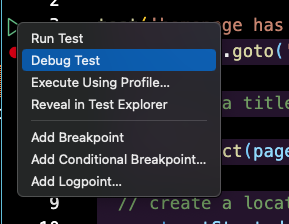

# Debugging

Although slowing down tests can give a better impression of what is going on, we often would like to be able to zoom in to specific parts of the tests, especially if those parts fail.

## Exercise: With Playwright inspector

Try to run all test in debug mode with the following command:

`npx playwright test --debug`

We now have visual feedback of the user clicking a part of the page.
Although this already provides some idea of what is happening where, it is fram from ideal and luckily there is a better way.

## Exercise: With the VSCode Playwright extension

In Visual Studio Code, search for the `playwright` extension. You will need the one that has the verified by Microsoft icon:

Install this extension.
If you go to your Test explorer in VSCode and hit the refresh button at the top, you will see that the Playwright test is being loaded. This will work for all Playwright tests, meaning you can click which test you want to run or even better, debug.
To debug your test: 

1. Open the `example.spec.ts` file
2. Create a breakpoint in your test, by clicking in the gutter left of the line number.
3. Right click on the green play button and click on `Debug test`
    
4. You'll notice that the test execution stops at the breakpoint that you defined. You can for example continue, step over and step into the test. You can also hover over properties to see the values. You are even able to change the test on the fly by adding a selector for example.
5. Experiment a bit with the debugger. How can this help you in your environment?