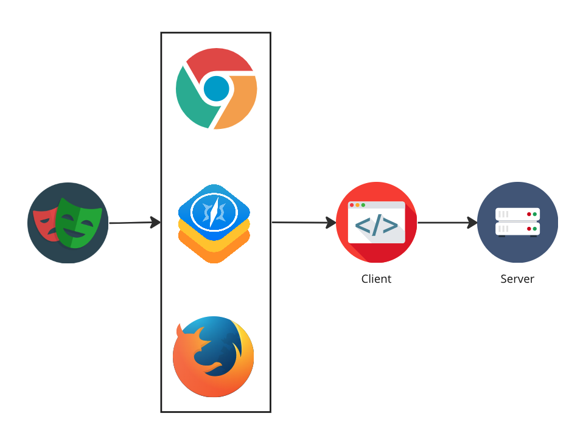

# Application integration
Up until now we have used a default Playwright test that navigates to the Playwright website and verifies the content is as expected. In a real world scenario we would like test our own application. In this exercise you will learn how to integrate Playwright with your application.

## The application
The application that we will be using is a tabular music tracker. It consists of a server part, which communicates to the database. The most visible part is the client, which runs in a browser. It is built with VueJS, which is a front end framework. 
We will focus on testing the client with Playwright.



## Exercise: Starting the client & server

Create 2 terminals in VSCode before continuing. Recall that this can be done with [Ctrl + Shift + \`] (Windows) or [Cmd + Shift + \`] (macOS).

Remove the slowmo option from the config if you still have it there.

In the first terminal, from the root of the project run the following commands:

``` bash
     cd server
     npm i
     npm start
```

In the second terminal, run the following:

``` bash
    cd client
    npm i
    npm start
 ```

Now go to <http://localhost:8080> to check if everything is running correctly.

## Exercise: Recording your first test
Once the client is started, the browser is automatically opened. Let's get started and record our first test. Later we can focus on the syntax.

1. In VSCode go the the test explorer in the left panel. It has the form of an Erlenmeyer flask.
2. Click on `Record new` at the bottom. Playwright will automatically create a new test `test-1.spec.ts` and open a browser.
3. In that browser, navigate to `localhost:8080`
4. Click around a bit depending on what you would like to test and close the browser when you are done.
5. You will see some duplicate code, but for now let's try to run the test by clicking on the play button left of the generated test or in the test explorer.
6. The browser will stay open. Check that your test has passed in the test explorer and close the browser either by closing it yourself or through `Close all browsers` at the bottom of the test explorer.

## Exercise: Cleaning up
Clean code is what we should strive for. The same holds for tests. See if you can remove duplicate test steps and shave off some time from the total test run.